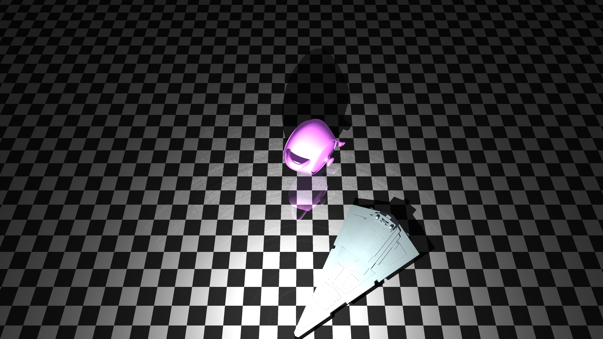
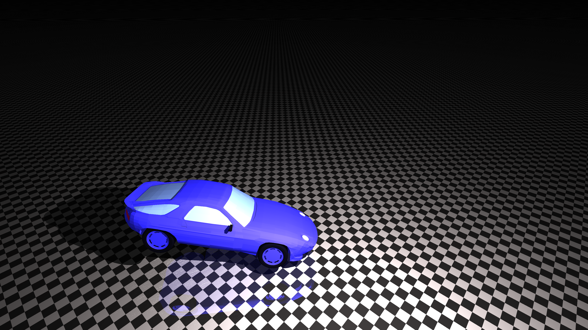
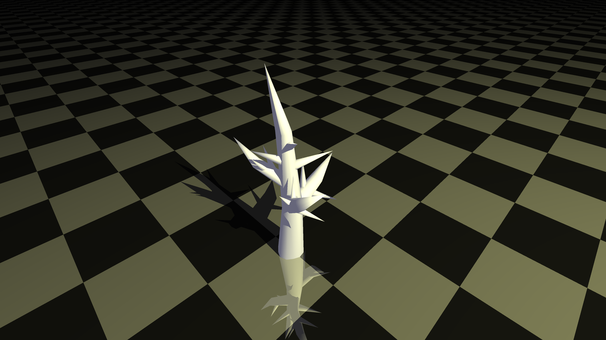

# 🚀 GPU-Accelerated Raytracer

<p align="center">
  
</p>

<p align="center">
  
  
  
</p>

A GPU-accelerated raytracer written in **C++20** using **OpenGL Compute Shaders**.

The project was originally developed as part of the *Softwareprojekt* module at **Ulm University of Applied Sciences (THU)** by **Team JK FlipFlop** and is currently being cleaned up and extended beyond the original university project.

> [!WARNING]
> This project is still under development. Current releases may contain bugs, incomplete features, rendering artifacts, or unsupported edge cases.

---

## 📷 Examples

| Example 1                                   | Example 2                                   | Example 3                                   |
| ------------------------------------------- | ------------------------------------------- | ------------------------------------------- |
|  |  |  |

The corresponding example scenes can be downloaded below.

* [Example 1](resources/example_scenes/Example_1.zip)
* [Example 2](resources/example_scenes/Example_2.zip)
* [Example 3](resources/example_scenes/Example_3.zip)

The ZIP archives can be opened directly through the application's scene loading functionality.

---

## ✨ Features

* GPU raytracing using an OpenGL Compute Shader
* Interactive preview rendering
* OBJ model loading using TinyObjLoader
* MTL material support
* Automatic triangulation of imported geometry
* Multiple configurable lights
* Editable object transformations

  * Translation
  * Rotation
  * Scaling
* Free camera movement
* Adjustable field of view
* Configurable background color
* Scene saving and loading using JSON/ZIP archives
* PNG/JPG image export
* ImGui-based graphical user interface
* Runtime logging

---

## ⚠️ Rendering Workflow

Raytracing performance strongly depends on the selected output resolution.

> [!IMPORTANT]
> **Always use a low resolution while editing the scene.**
>
> Moving objects, lights, or the camera at high resolutions can significantly reduce performance.
>
> Recommended workflow:
>
> 1. Select a **low resolution**.
> 2. Position objects, lights, and the camera.
> 3. Adjust the scene until the desired composition is reached.
> 4. Switch to the desired **high resolution**.
> 5. Start the final raytrace.

Using a high resolution during normal scene editing is not recommended.

---

## 📦 Running a Release

Pre-built versions can be downloaded from the repository's **Releases** section:

[Download the latest release](https://github.com/Lyro7/Raytracer/releases/latest)

Download the release archive, extract it, and run the included executable.

> [!WARNING]
> Releases currently represent development versions of the raytracer and should not be considered stable production builds.
>
> Some features may still contain bugs or behave unexpectedly in certain scenes.

---

## 🛠️ Building from Source

The project uses **CMake** for build configuration.

### Requirements

* C++20 compatible compiler
* CMake
* OpenGL 4.3+ compatible GPU and driver

### Clone

```bash
git clone --recurse-submodules https://github.com/Lyro7/Raytracer.git
cd Raytracer
```

If the repository was cloned without its submodules:

```bash
git submodule update --init --recursive
```

### Configure

```bash
cmake -S . -B build
```

### Build

```bash
cmake --build build --config Release
```

---

## 📂 Scene Files

Scenes can be exported and imported as ZIP archives.

A scene archive contains the scene description together with the model assets required by the scene.

A typical archive looks like this:

```text
Example.zip
│
├── scene.json
│
└── assets/
    └── models/
        ├── DeadTree.obj
        └── DeadTree.mtl
```

Paths stored inside the JSON file are relative to the root directory of the scene.

For example:

```json
{
  "name": "DeadTree",
  "path": "assets/models/DeadTree.obj"
}
```

requires the archive to contain:

```text
assets/models/DeadTree.obj
```

If the OBJ references an MTL file:

```obj
mtllib DeadTree.mtl
```

For automatic model importing, the corresponding MTL file must be located next to the OBJ file and have the exact same base name.

```text
assets/
└── models/
    ├── DeadTree.obj
    └── DeadTree.mtl
```

---

### Manually Creating a Scene Archive

Scene ZIP archives can also be assembled manually.

The directory structure must match the paths stored inside `scene.json`.

For example:

```text
scene.json
assets/
└── models/
    ├── model.obj
    └── model.mtl
```

The files should then be zipped while preserving that structure:

```text
MyScene.zip
├── scene.json
└── assets/
    └── models/
        ├── model.obj
        └── model.mtl
```

> [!IMPORTANT]
> `scene.json` and the `assets` directory must be placed at the expected archive level.
>
> Do not introduce an additional parent directory inside the ZIP unless the paths inside the JSON file account for it.

---

## 📝 Logging

Runtime information, warnings, and errors are written to:

```text
out/log.txt
```

The log file can be useful when diagnosing problems related to:

* Model loading
* MTL material loading
* Scene importing
* Scene exporting
* Rendering
* GPU or OpenGL errors

---

## 🏗️ Architecture

The raytracer separates CPU-side scene management from the data representation used by the GPU.

### Rendering Flow

1. **Scene Loading**
   Scene descriptions and model assets are loaded on the CPU.

2. **Geometry Processing**
   OBJ geometry and materials are converted into the internal scene representation.

3. **GPU Upload**
   Scene parameters, triangles, mesh information, lights, and materials are transferred to GPU buffers.

4. **Compute Shader**
   Ray generation, triangle intersection, and shading are performed on the GPU.

5. **Output**
   The resulting image is written to a texture and displayed inside the application viewport.

---

## 🔧 Technologies

* **C++20**
* **OpenGL**
* **GLSL Compute Shaders**
* **GLFW**
* **GLAD**
* **GLM**
* **Dear ImGui**
* **TinyObjLoader**
* **nlohmann/json**
* **miniz**
* **stb**

---

## 👥 Original Project Team — JK FlipFlop

The original university project was developed by eight students:

* **Niklas Kümmel** — Product Owner, Backend, Shader
* **Serhat Gürel** — Scrum Master, UI
* **Jeremy Diem** — UI, File Explorer, Concepts
* **Gabriel Penkert** — UI, Logging
* **Lovro Lupis** — Architecture, Engine Core, CPU–GPU Data Synchronization
* **Alton Bekolli** — JSON Parser, Import/Export, Shader Contributions
* **Felix Kussmann** — Camera
* **Valentin Talmon-l'Armée** — JSON Parser

---

*Originally developed at Ulm University of Applied Sciences (THU), 2025/2026.*
